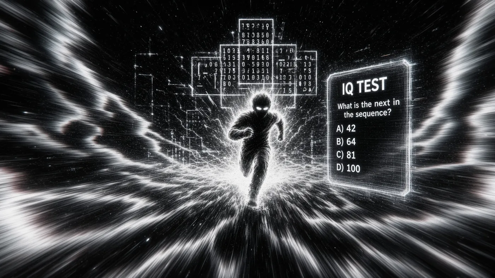
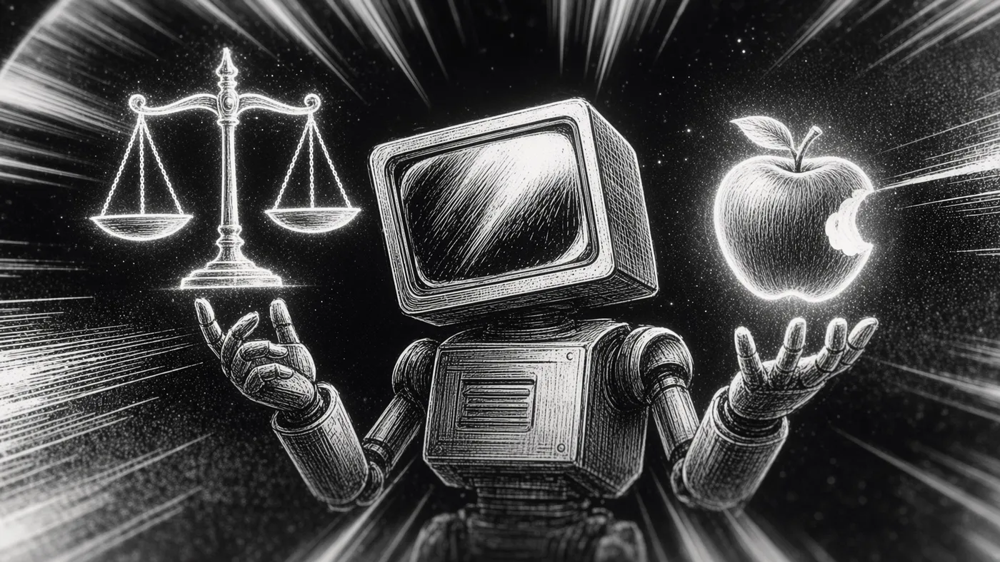

In 1966, the first chatbot, ELIZA, was created by Joseph Weizenbaum. The interesting thing about ELIZA is that it didn't use AI at all — it was just software that matched the words you typed and rephrased them as questions.

Weizenbaum was disturbed by this: people couldn't tell ELIZA didn't understand anything at all. Sixty years later, this debate continues with better systems, bigger budgets, and more sophisticated software.

If you're a technical person, you understand that the release of ChatGPT was a game changer, and during the last couple of years people keep asking themselves: is an LLM intelligent?

Although there are different definitions of intelligence, the industry keeps telling us that superintelligence is around the corner. I don't think the claim is wrong, but I do think it's unverifiable.

My argument is: if there is no precise definition of intelligence, how would we know we achieved superintelligence?

## We Haven't Figured It Out, Yet

Think about an LLM model — ChatGPT, Claude, Grok, or Gemini. Are they intelligent, or can we just not tell? Dictionaries define intelligence as the ability to learn or understand things, or to deal with new or difficult situations.

First of all, what's "difficult"? While repairing an airplane is difficult for us, there is no chance a border collie could repair it, even though border collies are a smart dog breed.

Intelligence is not something we know precisely. Intelligence as we understand it is a broader, subjective space. If an average MIT engineer travels back to the 3rd or 4th century, they could be the most intelligent person in the whole world — but if the smartest person in ancient Rome travels to the 21st century, they might have average intelligence. This happens because we measure intelligence through comparison instead of anything precise. All humans are considered intelligent, yet some people are smarter than others.

The most accepted method, the IQ test, is highly controversial as to whether it can actually measure intelligence. As a quick refresher: IQ tests were created in the early 20th century to measure the ability to solve certain problems, often called "intelligence," and the questions and scores are periodically updated to keep 100 as the average.

But why can't the IQ test be fixed once and never updated?

### The Flynn Effect

A couple of decades after the IQ test was implemented, a trend was observed: IQ scores rise about 3 points per decade on average. This is called the Flynn effect. Experts suggest a few theories for why this happens:

- Exposure to abstract concepts
- Better healthcare
- Better nutrition
- More complex environments
- More universities and schools

So this is why IQ tests need updates. IQ scores aren't an absolute measure of intelligence — they measure intelligence relative to the current population.

## Are LLMs Intelligent?

So, what's intelligence? We haven't figured it out yet, but we might somehow understand what it is — it's just not objectively measurable, and not even easy to describe.

Some questions that challenge the intelligence definition:

- Are LLMs "intelligent" by themselves, or are they just using the accumulated culture and knowledge we've been collecting for years?
- Is efficiency part of what we understand by "intelligence"? A human can understand a rule from two or three examples, while an LLM may need millions of tokens.

Should we insist on understanding and defining intelligence? A few competing definitions, and why each one is hard to apply to a model:

- **How efficiently you acquire new skills**, rather than how well you perform ones you've already seen — but how do you measure this with an LLM? When do you know a situation is genuinely new and never seen before?
- **Multidimensional, measured across three components**: analytical, creative, and practical — but what if two LLMs get different results? How should we compare them?
- **Accomplishing goals in a given time and environment** — but who establishes that goal? Is the LLM "intelligent," or is it the person who set the goal?

As you can see, we have different definitions, but none of them settle the question. What is intelligence? At this point you should have figured out there is no simple answer — as humanity, we don't know what intelligence is or what it looks like. So what about superintelligence?

## Is Intelligence Tied to Current Times?

We now understand that intelligence is a difficult word to define, and we've applied that difficulty to LLMs. What about humanity? Could people from the 2nd century be considered intelligent? They didn't know calculus or algebra — so how can we say they were intelligent?

Here's the challenge: is a human being intelligent by itself, regardless of the current state of technology? Some authors think intelligence also depends on the environment — no one invents calculus without a decent numeric system. So maybe, in this era, we're just not intelligent enough. Or is intelligence tied to the current era? Then what does superintelligence look like?

## Superintelligence

Superintelligence is the hypothetical software-based AI system with an intellectual scope beyond human intelligence. But based on what we've established, we don't know what intelligence is — so how should we define this? Something that doesn't make mistakes?

Imagine asking a hypothetical superintelligent model something genuinely subjective: *"What's the meaning of life?"* Will it reply with a philosophical or a biological perspective? Should it answer with multiple points of view? Is it not so intelligent because it can't explain it in simple terms?

This is my point: now that we know intelligence is something more difficult to understand, we're not even close to understanding what superintelligence is.

### Is Superintelligence Ethical?

How would a superintelligence behave in an ethical space? It seems "intelligence" (again, we don't know exactly what it is) may not be contingent on the time we live in — but the way we measure it might be. A person from the 1300s could still be considered intelligent, even though their answers wouldn't be aligned with 21st-century morality.

So what does superintelligence look like in that space? We, as humans, have a morality applicable to the year 2026, but we're far from what morality will look like in the year 2300. Can we define superintelligence as something that can make mistakes and have ethical errors? Or will it define the future morality for us?

If a "superintelligent" AI model gave us a response we consider ethically wrong, we wouldn't be able to tell if it's wrong — or if it's just beyond our time.

## Two Ways to Get This Wrong

Without a way to measure intelligence, we're destined to be exposed to two errors:

- Build something superhuman and fail to notice.
- Decide we've arrived when we haven't.

The second one shapes policies and moves money, and the worst part is that it isn't hypothetical.

## Final Thoughts

The lack of a definition of intelligence, and a clear view of how to measure it, could make us blind to what we've already achieved. Superintelligence seems to be something that will keep changing, or something that will always sit above our current knowledge — making the intelligence and superintelligence we'll recognize in the year 2100 different from what we imagine today.

Maybe ELIZA didn't show us what intelligence is. Maybe it showed us that we can't notice the difference.

---

### References

1. EBSCO (n.d.) *Standardized testing and IQ testing controversies*. Available at: [ebsco.com](https://www.ebsco.com/research-starters/education/standardized-testing-and-iq-testing-controversies) (Accessed: 23 August 2026).
2. Cogn-IQ (n.d.) *The Flynn effect — why IQ scores rose ~3 points per decade*. Available at: [cogn-iq.org](https://www.cogn-iq.org/learn/theory/flynn-effect/) (Accessed: 23 August 2026).
3. Chollet, F. (2019) *On the measure of intelligence*. arXiv:1911.01547. Available at: [arxiv.org](https://arxiv.org/abs/1911.01547) (Accessed: 26 August 2026).
4. Sternberg, R.J. (1985) *Beyond IQ: a triarchic theory of human intelligence*. Cambridge: Cambridge University Press.
5. Legg, S. and Hutter, M. (2007) 'Universal intelligence: a definition of machine intelligence', *Minds and Machines*, 17(4), pp. 391–444. Available at: [arxiv.org](https://arxiv.org/abs/0712.3329) (Accessed: 26 August 2026).
